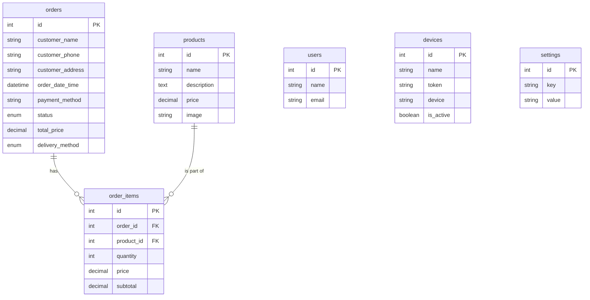

# Sistem Pemesanan Ayam Geprek via WhatsApp

Proyek ini adalah sistem pemesanan makanan berbasis WhatsApp yang dibangun dengan Laravel, Filament, dan Fonnte API. Sistem ini memungkinkan pengguna untuk melihat menu, melakukan pemesanan, dan mengelola pesanan mereka sepenuhnya melalui WhatsApp. Proyek ini juga dilengkapi dengan panel admin yang komprehensif bagi pemilik toko untuk mengelola produk, melacak pesanan, dan mengawasi operasional.

## Fitur

- **Bot Pemesanan WhatsApp:**
  - **Menu Interaktif:** Pengguna dapat meminta menu produk langsung di WhatsApp.
  - **Pemesanan Terpandu:** Proses langkah demi langkah memandu pengguna dalam memilih produk, menentukan jumlah, dan mengonfirmasi pesanan mereka.
  - **Pendaftaran Pengguna:** Pengguna baru akan diminta untuk memberikan nama dan alamat mereka.
  - **Sintaks Pemesanan Fleksibel:** Mendukung berbagai format untuk pemesanan (misalnya, `1`, `1 2`, `1=2, 2=1`).
  - **Manajemen Pesanan:** Pengguna dapat menambahkan item ke pesanan sebelumnya (`tambah`), membatalkan pesanan yang tertunda (`batal`), dan mengatur ulang sesi mereka (`reset`).
  - **Pengiriman & Pembayaran:** Mendukung metode pembayaran `takeaway` (ambil sendiri) atau `delivery` (diantar) dan `cash` (tunai) atau `transfer`.
- **Panel Admin (Filament):**
  - **Dasbor:** Gambaran umum penjualan, dengan grafik untuk pesanan per hari.
  - **Manajemen Produk:** Antarmuka CRUD untuk mengelola item makanan (nama, deskripsi, harga, gambar).
  - **Manajemen Pesanan:** Melihat dan mengelola semua pesanan yang masuk, statusnya, dan detail pelanggan.
  - **Manajemen Perangkat:** Mengelola perangkat WhatsApp yang terhubung melalui Fonnte API.
  - **Manajemen Pengguna:** Mengelola pengguna admin.
- **Pengaturan Otomatis:**
  - Satu perintah (`php artisan whatsapp:setup`) untuk menginisialisasi database dan memandu melalui pengaturan ngrok.
  - Skrip shell (`./update_ngrok.sh`) untuk memperbarui file `.env` secara otomatis dengan URL webhook ngrok.

## Teknologi yang Digunakan

- **Backend:** Laravel 12
- **Panel Admin:** Filament 4
- **Frontend:** Vite, Tailwind CSS
- **Gateway WhatsApp:** [Fonnte API](https://fonnte.com/)
- **Database:** MySQL/MariaDB (atau DB lain yang didukung Laravel)
- **Tunneling Pengembangan:** Ngrok

## Skema Database

Tabel database utama meliputi:
- `products`: Menyimpan semua produk yang tersedia.
- `orders`: Merekam semua pesanan pelanggan.
- `order_items`: Berisi produk dan jumlah spesifik untuk setiap pesanan.
- `devices`: Menyimpan kredensial perangkat WhatsApp Fonnte.
- `users`: Untuk akun pengguna panel admin.
- `settings`: Untuk pengaturan umum aplikasi.

### Diagram Hubungan Entitas (ERD)



## Pengaturan Pengembangan Lokal

### Prasyarat

- PHP 8.2+
- Composer
- Node.js & NPM
- Akun [Fonnte](https://fonnte.com/)
- [Ngrok](https://ngrok.com/) terinstal dan terautentikasi

### Langkah-langkah Instalasi

1.  **Clone repositori:**
    ```bash
    git clone <url-repositori>
    cd geprek
    ```

2.  **Instal dependensi:**
    ```bash
    composer install
    npm install
    ```

3.  **Konfigurasi Lingkungan:**
    - Salin file lingkungan contoh:
      ```bash
      cp .env.example .env
      ```
    - Buat kunci aplikasi:
      ```bash
      php artisan key:generate
      ```
    - Konfigurasikan koneksi database Anda di file `.env` (`DB_HOST`, `DB_PORT`, `DB_DATABASE`, `DB_USERNAME`, `DB_PASSWORD`).
    - Tambahkan Token Akun Fonnte Anda ke file `.env`:
      ```
      ACCOUNT_TOKEN=token_fonnte_anda
      ```

4.  **Jalankan Perintah Pengaturan Otomatis:**
    Perintah ini akan melakukan migrasi database, mengisinya dengan data awal, dan memandu Anda melalui pengaturan ngrok jika diperlukan.
    ```bash
    php artisan whatsapp:setup
    ```

5.  **Jalankan Layanan:**
    - Jalankan server pengembangan Laravel:
      ```bash
      php artisan serve
      ```
    - Di terminal baru, jalankan ngrok untuk mengekspos server lokal Anda:
      ```bash
      ngrok http 8000
      ```

6.  **Atur URL Webhook:**
    - Di terminal ketiga, jalankan skrip untuk memperbarui file `.env` Anda dengan URL ngrok.
      ```bash
      ./update_ngrok.sh
      ```
    - Skrip akan menampilkan URL webhook. Salin URL ini dan tempelkan ke pengaturan webhook di [Dasbor Fonnte](https://fonnte.com/device) Anda. URL akan terlihat seperti ini: `https://<subdomain-ngrok-anda>.ngrok-free.app/webhook/whatsapp`.

7.  **Build Aset Frontend:**
    ```bash
    npm run dev
    ```

## Penggunaan

### Bot WhatsApp

- **Mulai percakapan:** Kirim pesan apa pun (misalnya, "halo") ke nomor WhatsApp yang terhubung dengan perangkat Fonnte Anda.
- **Lihat menu:** Kirim "menu".
- **Buat pesanan:** Ikuti petunjuk di layar.
  - Contoh 1 (Pesan satu porsi produk #1): `1`
  - Contoh 2 (Pesan tiga porsi produk #2): `2 3` atau `2=3`
  - Contoh 3 (Pesan dua porsi produk #1 dan satu produk #3): `1=2, 3=1`

### Panel Admin

- **URL:** `http://localhost:8000/admin`
- **Login:** Selama pengembangan lokal, Anda dapat menggunakan fitur login pengembang.
  - **Email:** `admin@testing.com`
  - **Password:** `password` (atau nilai apa pun, akan diabaikan)

## Perintah Artisan yang Tersedia

- `php artisan whatsapp:setup`: Perintah utama untuk pengaturan awal proyek.
- `php artisan chain:run --name=setup`: Menjalankan rantai migrasi dan seeding (digunakan oleh perintah setup).