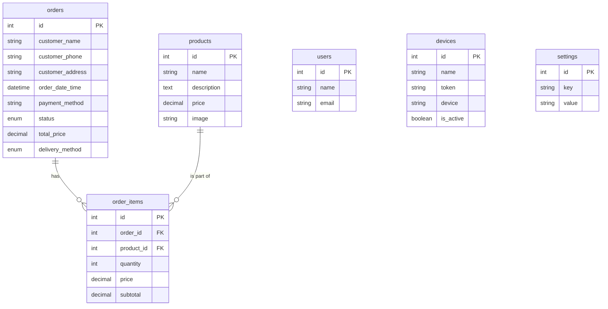

# Sistem Pemesanan Ayam Geprek via WhatsApp

Proyek ini adalah sistem pemesanan makanan berbasis WhatsApp yang dibangun dengan Laravel, Filament, dan Fonnte API. Sistem ini memungkinkan pengguna untuk melihat menu, melakukan pemesanan, dan mengelola pesanan mereka sepenuhnya melalui WhatsApp. Proyek ini juga dilengkapi dengan panel admin yang komprehensif bagi pemilik toko untuk mengelola produk, melacak pesanan, dan mengawasi operasional.

## Fitur

- **Bot Pemesanan WhatsApp:**
  - **Menu Interaktif:** Pengguna dapat meminta menu produk langsung di WhatsApp.
  - **Pemesanan Terpandu:** Proses langkah demi langkah memandu pengguna dalam memilih produk, menentukan jumlah, dan mengonfirmasi pesanan mereka.
  - **Pendaftaran Pengguna:** Pengguna baru akan diminta untuk memberikan nama dan alamat mereka.
  - **Sintaks Pemesanan Fleksibel:** Mendukung berbagai format untuk pemesanan (misalnya, `1`, `1 2`, `1=2, 2=1`).
  - **Manajemen Pesanan:** Pengguna dapat menambahkan item ke pesanan sebelumnya (`tambah`), membatalkan pesanan yang tertunda (`batal`), dan mengatur ulang sesi mereka (`reset`).
  - **Pengiriman & Pembayaran:** Mendukung metode pembayaran `takeaway` (ambil sendiri) atau `delivery` (diantar) dan `cash` (tunai) atau `transfer`.
- **Panel Admin (Filament):**
  - **Dasbor:** Gambaran umum penjualan, dengan grafik untuk pesanan per hari.
  - **Manajemen Produk:** Antarmuka CRUD untuk mengelola item makanan (nama, deskripsi, harga, gambar).
  - **Manajemen Pesanan:** Melihat dan mengelola semua pesanan yang masuk, statusnya, dan detail pelanggan.
  - **Manajemen Perangkat:** Mengelola perangkat WhatsApp yang terhubung melalui Fonnte API.
  - **Manajemen Pengguna:** Mengelola pengguna admin.
- **Pengaturan Otomatis:**
  - Satu perintah (`php artisan whatsapp:setup`) untuk menginisialisasi database dan memandu melalui pengaturan ngrok.
  - Skrip shell (`./update_ngrok.sh`) untuk memperbarui file `.env` secara otomatis dengan URL webhook ngrok.

## Teknologi yang Digunakan

 - **Backend:** Laravel 12
 - **Panel Admin:** Filament 4
 - **Frontend:** Vite, Tailwind CSS
 - **Gateway WhatsApp:** [Fonnte API](https://fonnte.com/)
 - **Database:** SQLite (default), MySQL/MariaDB, atau DB lain yang didukung Laravel
 - **Tunneling Pengembangan:** Ngrok

## 📁 File Penting untuk Development

### **Scripts:**
- `cloudflare-tunnel.sh` - Jalankan Cloudflare Tunnel (RECOMMENDED) ⭐
- `test-webhook.sh` - Test webhook secara otomatis
- `ngrok-static.sh` - Jalankan ngrok dengan URL static (alternatif)
- `update_ngrok.sh` - Update webhook URL otomatis (untuk ngrok biasa)

### **Laravel Commands:**
- `php artisan whatsapp:setup` - Setup awal project
- `php artisan serve --port=8000` - Jalankan development server

### **Dokumentasi:**
- [`documentation/QUICK-START-CLOUDFLARE.md`](documentation/QUICK-START-CLOUDFLARE.md) - Quick start Cloudflare Tunnel
- [`documentation/CLOUDFLARE-TUNNEL-SETUP.md`](documentation/CLOUDFLARE-TUNNEL-SETUP.md) - Panduan lengkap Cloudflare Tunnel
- [`documentation/NGROK-SETUP.md`](documentation/NGROK-SETUP.md) - Panduan ngrok (alternatif)

## 🌐 Tunneling Options untuk Development

Project ini mendukung **2 pilihan tunneling** untuk webhook development:

### **Option 1: Cloudflare Tunnel (RECOMMENDED)** ⭐

**Keuntungan:**
- ✅ URL static yang pendek: `local.testingbae0000.my.id`
- ✅ Gratis selamanya tanpa batasan
- ✅ Command simple dan tidak perlu diulang-ulang
- ✅ Lebih stabil untuk webhook

**Quick Setup:**
```bash
# 1. Jalankan Laravel server
php artisan serve --port=8000

# 2. Di terminal baru, jalankan Cloudflare Tunnel
./cloudflare-tunnel.sh 8000

# 3. Webhook URL: https://local.testingbae0000.my.id/webhook/whatsapp
```

📚 **[Panduan Lengkap Cloudflare Tunnel](documentation/QUICK-START-CLOUDFLARE.md)**

### **Option 2: ngrok Static URL**

**URL Static Default:**
```
https://toad-current-humbly.ngrok-free.app
```

**Quick Setup:**
```bash
# 1. Jalankan Laravel server
php artisan serve --port=8000

# 2. Di terminal baru, jalankan ngrok static
./ngrok-static.sh 8000

# 3. Webhook URL: https://toad-current-humbly.ngrok-free.app/webhook/whatsapp
```

📚 **[Panduan Lengkap ngrok](documentation/NGROK-SETUP.md)**

> **💡 Rekomendasi:** Gunakan Cloudflare Tunnel untuk development yang lebih mudah dan stabil!

## Skema Database

Tabel database utama meliputi:
- `products`: Menyimpan semua produk yang tersedia.
- `orders`: Merekam semua pesanan pelanggan.
- `order_items`: Berisi produk dan jumlah spesifik untuk setiap pesanan.
- `devices`: Menyimpan kredensial perangkat WhatsApp Fonnte.
- `users`: Untuk akun pengguna panel admin.
- `settings`: Untuk pengaturan umum aplikasi.

### Diagram Hubungan Entitas (ERD)



## Pengaturan Pengembangan Lokal

### Prasyarat

- PHP 8.2+
- Composer
- Node.js & NPM
- Akun [Fonnte](https://fonnte.com/)
- [Ngrok](https://ngrok.com/) terinstal dan terautentikasi

### Langkah-langkah Instalasi

1.  **Clone repositori:**
    ```bash
    git clone <url-repositori>
    cd geprek
    ```

2.  **Instal dependensi:**
    ```bash
    composer install
    npm install
    ```

3.  **Konfigurasi Lingkungan:**
    - Salin file lingkungan contoh:
      ```bash
      cp .env.example .env
      ```
    - Buat kunci aplikasi:
      ```bash
      php artisan key:generate
      ```
    - Konfigurasikan koneksi database Anda di file `.env`. Default menggunakan SQLite (file `database/database.sqlite` akan dibuat otomatis). Untuk database lain seperti MySQL, konfigurasikan `DB_HOST`, `DB_PORT`, `DB_DATABASE`, `DB_USERNAME`, `DB_PASSWORD`.
    - Tambahkan Token Akun Fonnte Anda ke file `.env`:
      ```
      ACCOUNT_TOKEN=token_fonnte_anda
      ```

4.  **Jalankan Perintah Pengaturan Otomatis:**
    Perintah ini akan memeriksa dan membuat file database SQLite jika belum ada, melakukan migrasi database, mengisinya dengan data awal, dan memandu Anda melalui pengaturan ngrok jika diperlukan.
    ```bash
    php artisan whatsapp:setup
    ```

5.  **Jalankan Layanan:**
    - Jalankan server pengembangan Laravel:
      ```bash
      php artisan serve --port=8000
      ```
    - Di terminal baru, jalankan Cloudflare Tunnel (RECOMMENDED):
      ```bash
      ./cloudflare-tunnel.sh 8000
      ```
    - Atau gunakan ngrok (alternatif):
      ```bash
      ./ngrok-static.sh 8000
      ```

6.  **Atur URL Webhook:**
    - **Untuk Cloudflare Tunnel:**
      Webhook URL: `https://local.testingbae0000.my.id/webhook/whatsapp`
      
    - **Untuk ngrok:**
      Jalankan skrip untuk mendapatkan URL webhook:
      ```bash
      ./update_ngrok.sh
      ```
      
    - Salin URL webhook dan tempelkan ke pengaturan webhook di [Dasbor Fonnte](https://fonnte.com/device) Anda.

    📚 **Lihat:** [Panduan Cloudflare Tunnel](documentation/QUICK-START-CLOUDFLARE.md) atau [Panduan ngrok](documentation/NGROK-SETUP.md)

7.  **Build Aset Frontend:**
    ```bash
    npm run dev
    ```

## Penggunaan

### Bot WhatsApp

- **Mulai percakapan:** Kirim pesan apa pun (misalnya, "halo") ke nomor WhatsApp yang terhubung dengan perangkat Fonnte Anda.
- **Lihat menu:** Kirim "menu".
- **Buat pesanan:** Ikuti petunjuk di layar.
  - Contoh 1 (Pesan satu porsi produk #1): `1`
  - Contoh 2 (Pesan tiga porsi produk #2): `2 3` atau `2=3`
  - Contoh 3 (Pesan dua porsi produk #1 dan satu produk #3): `1=2, 3=1`

### Panel Admin

- **URL:** `http://localhost:8000/admin`
- **Login:** Selama pengembangan lokal, Anda dapat menggunakan fitur login pengembang.
  - **Email:** `admin@testing.com`
  - **Password:** `password` (atau nilai apa pun, akan diabaikan)

## Troubleshooting

### **Webhook Issues:**

**❌ "Webhook tidak bekerja":**
```bash
# Test webhook secara otomatis
./test-webhook.sh

# Test manual
curl https://local.testingbae0000.my.id/webhook/whatsapp
```

**❌ "Cloudflared tidak ditemukan":**
```bash
# Ubuntu/Debian
wget -q https://github.com/cloudflare/cloudflared/releases/latest/download/cloudflared-linux-amd64.deb
sudo dpkg -i cloudflared-linux-amd64.deb
```

**❌ "Port 8000 sudah digunakan":**
```bash
# Cek proses yang menggunakan port
lsof -i :8000
# Bunuh proses jika perlu
kill -9 <PID>
```

### **WhatsApp Webhook Issues:**

**❌ "Webhook tidak merespons":**
- Pastikan Laravel server running di port 8000
- Test dengan: `./test-webhook.sh`
- Cek logs: `tail -f storage/logs/laravel.log`

**❌ "Fonnte device tidak terhubung":**
- Cek token Fonnte di file `.env`
- Pastikan device aktif di dashboard Fonnte
- Pastikan webhook URL sudah diset di Fonnte

### **Database Issues:**

**❌ "Database connection failed":**
```bash
# Untuk SQLite
touch database/database.sqlite

# Untuk MySQL
php artisan config:clear
php artisan migrate
```

📚 **Panduan lengkap troubleshooting:**
- [Cloudflare Tunnel Troubleshooting](documentation/CLOUDFLARE-TUNNEL-SETUP.md#troubleshooting)
- [ngrok Troubleshooting](documentation/NGROK-SETUP.md#troubleshooting)

## 💡 Tips Praktis

### **Development Workflow Harian (Cloudflare Tunnel - RECOMMENDED):**
```bash
# Terminal 1 - Laravel server
php artisan serve --port=8000

# Terminal 2 - Cloudflare Tunnel
./cloudflare-tunnel.sh 8000

# Terminal 3 - Test webhook (optional)
./test-webhook.sh
```

### **Testing WhatsApp Bot:**
1. Pastikan tunnel running: `./cloudflare-tunnel.sh 8000`
2. Test webhook: `./test-webhook.sh`
3. Setup webhook di Fonnte: `https://local.testingbae0000.my.id/webhook/whatsapp`
4. Test kirim pesan ke nomor WhatsApp yang terhubung
5. Monitor logs: `tail -f storage/logs/laravel.log`

## Perintah Artisan yang Tersedia

 - `php artisan whatsapp:setup`: Perintah utama untuk pengaturan awal proyek. Memeriksa dan membuat file database SQLite jika diperlukan, menjalankan migrasi, seeding, dan pengaturan ngrok.
 - `php artisan chain:run --name=setup`: Menjalankan rantai migrasi dan seeding (digunakan oleh perintah setup).

---

## 🎯 Quick Reference

| Task | Command/File |
|------|-------------|
| **Setup awal** | `php artisan whatsapp:setup` |
| **Run server** | `php artisan serve --port=8000` |
| **Run tunnel** | `./cloudflare-tunnel.sh 8000` (recommended) |
| **Test webhook** | `./test-webhook.sh` |
| **Admin panel** | `http://localhost:8000/admin` |
| **Webhook URL** | `https://local.testingbae0000.my.id/webhook/whatsapp` |

## 📚 Dokumentasi Lengkap

Semua dokumentasi tersedia di folder [`documentation/`](documentation/):

- **[Quick Start Cloudflare Tunnel](documentation/QUICK-START-CLOUDFLARE.md)** - Setup cepat dalam 3 langkah ⭐
- **[Panduan Lengkap Cloudflare Tunnel](documentation/CLOUDFLARE-TUNNEL-SETUP.md)** - Instalasi, konfigurasi, troubleshooting
- **[Panduan ngrok](documentation/NGROK-SETUP.md)** - Setup alternatif menggunakan ngrok
- **[API Documentation](documentation/)** - Coming soon

## 🤝 Contributing

Contributions are welcome! Please read our contributing guidelines before submitting PRs.

## 📄 License

This project is open-sourced software licensed under the [MIT license](LICENSE).
