# Class Diagram - Sistem Penjualan Ayam Geprek

```mermaid
classDiagram
    %% ============================================================
    %%  LEVEL ATAS (Top Level) - Pengguna & Pelanggan
    %%  Pelanggan, Penjual, Admin
    %% ============================================================

    class Pelanggan {
        +int $id
        +string $customer_name
        +string $customer_phone
        +string $customer_address
        +datetime $created_at
        +timestamps()
        +pesanMenu(): void
        +lihatMenu(): Collection
        +konfirmasiPesanan(): bool
        +batalkanPesanan(): bool
        +lihatRiwayatPesanan(): Collection
    }

    class Penjual {
        +int $id
        +string $name
        +string $email
        +string $phone
        +datetime $created_at
        +timestamps()
        +kelolaMenu(): void
        +kelolaPesanan(): void
        +updateStatusPesanan(): bool
        +lihatLaporanPenjualan(): Collection
    }

    class Admin {
        +int $id
        +string $name
        +string $email
        +datetime $created_at
        +timestamps()
        +kelolaPengguna(): void
        +kelolaProduk(): void
        +kelolaPesanan(): void
        +kelolaPengaturan(): void
        +generateLaporan(): Collection
        +kelolaHakAkses(): void
    }

    %% ============================================================
    %%  LEVEL BAWAH (Bottom Level) - Entitas Sistem
    %%  Produk, Kategori Produk, Pesanan, Device, Laporan
    %% ============================================================

    class Produk {
        +int $id
        +string $name
        +text $description
        +decimal $price
        +string $image
        +timestamps()
        +orderItems(): HasMany
        +isTersedia(): bool
        +getFormattedHarga(): string
        +updateStok($jumlah): bool
        +getGambarUrl(): string
    }

    class KategoriProduk {
        +int $id
        +string $nama
        +string $deskripsi
        +string $slug
        +int $parent_id
        +timestamps()
        +produk(): HasMany
        +parent(): BelongsTo
        +children(): HasMany
        +getProdukList(): Collection
        +addProduk($data): Produk
    }

    class Pesanan {
        +int $id
        +string $customer_name
        +string $customer_phone
        +string $customer_address
        +enum $status
        +datetime $order_date_time
        +enum $payment_method
        +decimal $total_price
        +enum $delivery_method
        +int $device_id
        +timestamps()
        +orderItems(): HasMany
        +device(): BelongsTo
        +products(): BelongsToMany
        +calculateTotal(): decimal
        +updateStatus($status): bool
        +isPending(): bool
        +isProcessing(): bool
        +isCompleted(): bool
        +isCancelled(): bool
        +isDraft(): bool
        +isConfirmed(): bool
        +scopeByStatus($query, $status): Builder
        +scopeByDateRange($query, $start, $end): Builder
    }

    class ItemPesanan {
        +int $id
        +int $order_id
        +int $product_id
        +int $quantity
        +decimal $price
        +decimal $subtotal
        +timestamps()
        +order(): BelongsTo
        +product(): BelongsTo
        +calculateSubtotal(): decimal
    }

    class Device {
        +int $id
        +string $name
        +string $token
        +string $device
        +bool $is_active
        +timestamps()
        +orders(): HasMany
        +syncWithFonnte(): bool
        +deactivate(): void
        +activate(): void
        +kirimPesan($target, $message): bool
    }

    class Pengaturan {
        +int $id
        +string $name
        +string $logo
        +string $address
        +string $phone
        +timestamps()
        +getValue($key): mixed
        +setValue($key, $value): bool
        +getTokoInfo(): array
        +updateLogo($path): bool
    }

    class Laporan {
        +int $id
        +string $jenis_laporan
        +datetime $periode_mulai
        +datetime $periode_selesai
        +decimal $total_pendapatan
        +int $total_transaksi
        +string $status
        +int $dibuat_oleh
        +timestamps()
        +getLaporanPenjualan(): Collection
        +getLaporanPesanan(): Collection
        +getLaporanProdukTerlaris(): Collection
        +exportPDF(): string
        +exportExcel(): string
    }

    %% ============================================================
    %%  ENTITAS PENDUKUNG (Supporting Entities)
    %% ============================================================

    class Pembayaran {
        +int $id
        +int $order_id
        +string $nomor_transaksi
        +decimal $jumlah
        +enum $metode
        +enum $status
        +datetime $tanggal_bayar
        +string $bukti_pembayaran
        +timestamps()
        +order(): BelongsTo
        +verifikasi(): bool
        +process(): bool
        +refund(): bool
        +getDetail(): array
    }

    class User {
        +int $id
        +string $name
        +string $email
        +datetime $email_verified_at
        +string $password
        +string $remember_token
        +json $custom_fields
        +timestamps()
        +roles(): BelongsToMany
        +permissions(): BelongsToMany
        +hasRole($role): bool
        +hasPermission($permission): bool
        +sendEmailVerificationNotification(): void
    }

    class Role {
        +int $id
        +string $name
        +string $guard_name
        +timestamps()
        +permissions(): BelongsToMany
        +users(): BelongsToMany
        +hasPermission($permission): bool
        +givePermissionTo($permission): self
    }

    class Permission {
        +int $id
        +string $name
        +string $guard_name
        +timestamps()
        +roles(): BelongsToMany
        +users(): BelongsToMany
    }

    %% ============================================================
    %%  ENUMS
    %% ============================================================

    class StatusPesanan {
        <<enumeration>>
        PENDING
        PROCESSING
        COMPLETED
        CANCELLED
        DRAFT
        CONFIRM
    }

    class MetodePembayaran {
        <<enumeration>>
        CASH
        TRANSFER
        E_WALLET
        QRIS
    }

    class MetodePengiriman {
        <<enumeration>>
        DINE_IN
        TAKEAWAY
        DELIVERY
    }

    class StatusPembayaran {
        <<enumeration>>
        BELUM_BAYAR
        MENUNGGU_VERIFIKASI
        SUDAH_BAYAR
        DIBATALKAN
        REFUND
    }

    %% ============================================================
    %%  RELATIONSHIPS
    %% ============================================================

    %% Relasi "Melakukan" - Level Atas ke Level Bawah
    Pelanggan "1" -- "*" Produk : melakukan (memilih/memesan)
    Pelanggan "1" -- "*" Pesanan : melakukan (membuat)
    Pelanggan "1" -- "*" Laporan : melakukan (melihat)

    Penjual "1" -- "*" Produk : mengelola
    Penjual "1" -- "*" Pesanan : mengelola
    Penjual "1" -- "*" Laporan : mengelola

    Admin "1" -- "*" Produk : mengelola
    Admin "1" -- "*" Pesanan : mengelola
    Admin "1" -- "*" Laporan : mengelola
    Admin "1" -- "*" Pengaturan : mengelola
    Admin "1" -- "*" Device : mengelola
    Admin "1" -- "*" User : mengelola

    %% Relasi Antar Entitas Level Bawah
    Produk "*" -- "1" KategoriProduk : belongsTo (opsional)
    Produk "1" -- "*" ItemPesanan : hasMany

    Pesanan "1" *-- "*" ItemPesanan : contains
    Pesanan "*" --> "1" Device : belongsTo

    ItemPesanan "*" --> "1" Produk : belongsTo
    ItemPesanan "*" --> "1" Pesanan : belongsTo

    Device "1" o-- "*" Pesanan : has

    Pesanan "1" -- "1" Pembayaran : has

    %% Relasi User & Role (Spatie Laravel Permission)
    User "1" -- "*" Role : has (belongsToMany)
    Role "*" -- "*" Permission : has (belongsToMany)
    User "*" -- "*" Permission : has (belongsToMany)

    %% User mapping ke entitas bisnis
    User ..> Pelanggan : can be
    User ..> Penjual : can be
    User ..> Admin : can be

    %% Enum associations
    Pesanan ..> StatusPesanan : uses
    Pesanan ..> MetodePembayaran : uses
    Pesanan ..> MetodePengiriman : uses
    Pembayaran ..> StatusPembayaran : uses
```



---

## Penjelasan Detail Class Diagram

### 📁 File Lokasi
- **File**: [docs/class_diagram.md](docs/class_diagram.md)

---

### 🏗️ Arsitektur Sistem

Sistem penjualan Ayam Geprek ini menggunakan struktur **2 level hierarki** sesuai gambar:

#### **Level Atas (Top Level)**
1. **Pelanggan** - Customer yang memesan ayam geprek via WhatsApp
2. **Penjual** - Pemilik/usaha yang menjual ayam geprek
3. **Admin** - Administrator sistem

#### **Level Bawah (Bottom Level)**
1. **Produk** - Menu ayam geprek yang dijual
2. **Kategori Produk** - Kategori menu (misal: Geprek, Minuman, Side Dish)
3. **Pesanan (Order)** - Transaksi penjualan
4. **Item Pesanan (OrderItem)** - Detail item dalam pesanan
5. **Device** - Perangkat WhatsApp untuk pesanan
6. **Pengaturan (Setting)** - Konfigurasi toko
7. **Laporan** - Laporan penjualan

---

### 📦 Penjelasan Setiap Class

#### **1. Pelanggan (Customer)**

Pelanggan dalam sistem ini adalah customer yang memesan melalui WhatsApp.

| Atribut | Tipe Data | Deskripsi |
|---------|-----------|-----------|
| `$id` | int | Primary key |
| `$customer_name` | string | Nama pelanggan |
| `$customer_phone` | string | Nomor telepon WhatsApp |
| `$customer_address` | string | Alamat pengiriman |
| `$created_at` | datetime | Tanggal dibuat (auto) |

| Method | Return | Deskripsi |
|--------|--------|-----------|
| `pesanMenu()` | void | Memesan menu ayam geprek |
| `lihatMenu()` | Collection | Melihat daftar menu |
| `konfirmasiPesanan()` | bool | Konfirmasi pesanan |
| `batalkanPesanan()` | bool | Membatalkan pesanan |
| `lihatRiwayatPesanan()` | Collection | Melihat riwayat pesanan |

---

#### **2. Penjual**

Penjual adalah pemilik usaha ayam geprek.

| Method | Return | Deskripsi |
|--------|--------|-----------|
| `kelolaMenu()` | void | Mengelola daftar menu |
| `kelolaPesanan()` | void | Mengelola pesanan masuk |
| `updateStatusPesanan()` | bool | Update status pesanan |
| `lihatLaporanPenjualan()` | Collection | Melihat laporan penjualan |

---

#### **3. Admin**

Administrator sistem dengan akses penuh.

| Method | Return | Deskripsi |
|--------|--------|-----------|
| `kelolaPengguna()` | void | Mengelola user system |
| `kelolaProduk()` | void | Mengelola produk |
| `kelolaPesanan()` | void | Mengelola semua pesanan |
| `kelolaPengaturan()` | void | Konfigurasi sistem |
| `generateLaporan()` | Collection | Generate laporan |
| `kelolaHakAkses()` | void | Mengatur permission |

---

#### **4. Produk**

Model `Product` merepresentasikan menu ayam geprek yang dijual.

**Mapping ke Database**: [app/Models/Product.php](app/Models/Product.php)

| Atribut | Tipe Data | Deskripsi | Database |
|---------|-----------|-----------|----------|
| `$id` | int | Primary key | `id` (bigint) |
| `$name` | string | Nama menu | `name` (varchar) |
| `$description` | text | Deskripsi menu | `description` (text, nullable) |
| `$price` | decimal | Harga satuan | `price` (decimal 10,2) |
| `$image` | string | URL gambar | `image` (varchar, nullable) |
| `$created_at` | datetime | Tanggal dibuat | `created_at` (timestamp) |
| `$updated_at` | datetime | Tanggal diupdate | `updated_at` (timestamp) |

| Method | Return | Deskripsi |
|--------|--------|-----------|
| `orderItems()` | HasMany | Relasi ke order items |
| `isTersedia()` | bool | Cek ketersediaan produk |
| `getFormattedHarga()` | string | Format harga ke Rupiah |
| `updateStok($jumlah)` | bool | Update stok produk |
| `getGambarUrl()` | string | Mendapatkan URL gambar |

---

#### **5. KategoriProduk**

Kategori untuk mengelompokkan menu (opsional - bisa ditambahkan).

| Atribut | Tipe Data | Deskripsi |
|---------|-----------|-----------|
| `$nama` | string | Nama kategori |
| `$deskripsi` | string | Deskripsi kategori |
| `$slug` | string | URL-friendly name |
| `$parent_id` | int | Untuk sub-kategori |

---

#### **6. Pesanan (Order)**

Model `Order` merepresentasikan transaksi penjualan.

**Mapping ke Database**: [app/Models/Order.php](app/Models/Order.php)

| Atribut | Tipe Data | Deskripsi | Database |
|---------|-----------|-----------|----------|
| `$id` | int | Primary key | `id` (bigint) |
| `$customer_name` | string | Nama pelanggan | `customer_name` (varchar, nullable) |
| `$customer_phone` | string | No. telepon | `customer_phone` (varchar, nullable) |
| `$customer_address` | string | Alamat | `customer_address` (varchar, nullable) |
| `$status` | enum | Status pesanan | `status` (enum: pending, processing, completed, cancelled, draft, confirm) |
| `$order_date_time` | datetime | Waktu pesanan | `order_date_time` (datetime, nullable, default: now) |
| `$payment_method` | enum | Metode bayar | `payment_method` (varchar, nullable) |
| `$total_price` | decimal | Total harga | `total_price` (decimal 10,2) |
| `$delivery_method` | enum | Metode kirim | `delivery_method` (enum: dine_in, takeaway, delivery) |
| `$device_id` | int | Foreign key | `device_id` (foreignId, nullable) |

**Status Constants**:
- `STATUS_PENDING` = 'pending'
- `STATUS_PROCESSING` = 'processing'
- `STATUS_COMPLETED` = 'completed'
- `STATUS_CANCELLED` = 'cancelled'
- `STATUS_DRAFT` = 'draft'
- `STATUS_CONFIRM` = 'confirm'

| Method | Return | Deskripsi |
|--------|--------|-----------|
| `orderItems()` | HasMany | Relasi ke order items |
| `device()` | BelongsTo | Relasi ke device |
| `products()` | BelongsToMany | Relasi ke produk |
| `calculateTotal()` | decimal | Hitung total harga |
| `updateStatus($status)` | bool | Update status pesanan |
| `isPending()` | bool | Cek status pending |
| `isProcessing()` | bool | Cek status processing |
| `isCompleted()` | bool | Cek status completed |
| `isCancelled()` | bool | Cek status cancelled |
| `isDraft()` | bool | Cek status draft |
| `isConfirmed()` | bool | Cek status confirm |

---

#### **7. ItemPesanan (OrderItem)**

Model `OrderItem` merepresentasikan detail item dalam pesanan.

**Mapping ke Database**: [app/Models/OrderItem.php](app/Models/OrderItem.php)

| Atribut | Tipe Data | Deskripsi | Database |
|---------|-----------|-----------|----------|
| `$id` | int | Primary key | `id` (bigint) |
| `$order_id` | int | Foreign key | `order_id` (foreignId, constrained, on delete: cascade) |
| `$product_id` | int | Foreign key | `product_id` (foreignId, constrained, on delete: cascade) |
| `$quantity` | int | Jumlah item | `quantity` (int) |
| `$price` | decimal | Harga satuan | `price` (decimal 10,2) |
| `$subtotal` | decimal | Subtotal | `subtotal` (decimal 10,2) |

| Method | Return | Deskripsi |
|--------|--------|-----------|
| `order()` | BelongsTo | Relasi ke order |
| `product()` | BelongsTo | Relasi ke produk |
| `calculateSubtotal()` | decimal | Hitung subtotal |

---

#### **8. Device**

Model `Device` untuk menyimpan perangkat WhatsApp.

**Mapping ke Database**: [app/Models/Device.php](app/Models/Device.php)

| Atribut | Tipe Data | Deskripsi | Database |
|---------|-----------|-----------|----------|
| `$id` | int | Primary key | `id` (bigint) |
| `$name` | string | Nama device | `name` (varchar) |
| `$token` | string | Token API | `token` (varchar) |
| `$device` | string | No. HP device | `device` (varchar, nullable) |
| `$is_active` | bool | Status aktif | `is_active` (boolean, default: true) |

| Method | Return | Deskripsi |
|--------|--------|-----------|
| `orders()` | HasMany | Relasi ke orders |
| `syncWithFonnte()` | bool | Sinkronisasi dengan Fonnte API |
| `deactivate()` | void | Nonaktifkan device |
| `activate()` | void | Aktifkan device |
| `kirimPesan($target, $message)` | bool | Kirim pesan WhatsApp |

---

#### **9. Pengaturan (Setting)**

Model `Setting` untuk konfigurasi toko.

**Mapping ke Database**: [app/Models/Setting.php](app/Models/Setting.php)

| Atribut | Tipe Data | Deskripsi | Database |
|---------|-----------|-----------|----------|
| `$id` | int | Primary key | `id` (bigint) |
| `$name` | string | Nama toko | `name` (varchar) |
| `$logo` | string | URL logo | `logo` (varchar, nullable) |
| `$address` | string | Alamat toko | `address` (varchar, nullable) |
| `$phone` | string | No. telepon toko | `phone` (varchar, nullable) |

---

#### **10. Pembayaran**

Entitas pembayaran untuk tracking transaksi.

| Atribut | Tipe Data | Deskripsi |
|---------|-----------|-----------|
| `$order_id` | int | Foreign key ke order |
| `$nomor_transaksi` | string | Nomor transaksi unik |
| `$jumlah` | decimal | Jumlah pembayaran |
| `$metode` | enum | Metode pembayaran |
| `$status` | enum | Status pembayaran |
| `$tanggal_bayar` | datetime | Tanggal bayar |
| `$bukti_pembayaran` | string | Bukti transfer |

---

#### **11. User & Role (Authentication)**

**Mapping ke Database**: [app/Models/User.php](app/Models/User.php)

Menggunakan **Spatie Laravel Permission** untuk manajemen role & permission.

| Atribut | Tipe Data | Deskripsi |
|---------|-----------|-----------|
| `$id` | int | Primary key |
| `$name` | string | Nama user |
| `$email` | string | Email user |
| `$password` | string | Password (hashed) |
| `$email_verified_at` | datetime | Tanggal verifikasi email |
| `$custom_fields` | json | Custom data tambahan |
| `$remember_token` | string | Token remember me |

---

### 🔗 Penjelasan Relasi

#### **1. Relasi "Melakukan" (Association)**

| Dari | Ke | Jenis | Deskripsi |
|------|-------|--------|-----------|
| Pelanggan | Produk | Association | Memilih/memesan menu |
| Pelanggan | Pesanan | Composition | Membuat pesanan baru |
| Penjual | Produk | Association | Mengelola menu |
| Penjual | Pesanan | Association | Memproses pesanan |
| Admin | Semua | Association | Mengelola seluruh sistem |

#### **2. Relasi Database (Eloquent ORM)**

| Relasi | Tipe | Deskripsi |
|--------|------|-----------|
| Order → OrderItem | HasMany | Satu order memiliki banyak item |
| OrderItem → Order | BelongsTo | Satu item milik satu order |
| OrderItem → Product | BelongsTo | Satu item mereferensikan satu produk |
| Product → OrderItem | HasMany | Satu produk ada di banyak order item |
| Order → Device | BelongsTo | Satu order dari satu device |
| Device → Order | HasMany | Satu device memiliki banyak order |

#### **3. Komposisi & Agregasi**

| Relasi | Jenis | Penjelasan |
|--------|-------|-----------|
| Order 1 -- * OrderItem | Composition | OrderItem tidak ada tanpa Order |
| Pelanggan 1 -- * Pesanan | Composition | Pesanan terikat dengan pelanggan |
| Product 1 -- * OrderItem | Agregation | Product independen dari OrderItem |

---

### 📊 Enums (Enumerations)

#### **StatusPesanan**
```
- PENDING    : Menunggu konfirmasi
- PROCESSING : Sedang diproses
- COMPLETED  : Selesai
- CANCELLED  : Dibatalkan
- DRAFT      : Draft pesanan
- CONFIRM    : Sudah dikonfirmasi
```

#### **MetodePembayaran**
```
- CASH    : Tunai
- TRANSFER : Transfer bank
- E_WALLET : E-wallet (GoPay, OVO, dll)
- QRIS    : QRIS
```

#### **MetodePengiriman**
```
- DINE_IN   : Makan di tempat
- TAKEAWAY  : Bawa pulang
- DELIVERY  : Antar ke alamat
```

#### **StatusPembayaran**
```
- BELUM_BAYAR         : Belum dibayar
- MENUNGGU_VERIFIKASI : Menunggu verifikasi
- SUDAH_BAYAR         : Sudah dibayar
- DIBATALKAN          : Dibatalkan
- REFUND              : Refund
```

---

### 🎯 Use Cases Utama

#### **Flow Pemesanan via WhatsApp**

```
1. Pelanggan → Kirim pesan "menu" ke WhatsApp
2. Sistem → Tampilkan daftar menu/produk
3. Pelanggan → Pilih menu (contoh: "1=2, 3=1")
4. Sistem → Buat order (status: DRAFT)
5. Pelanggan → Konfirmasi pesanan
6. Sistem → Update order (status: CONFIRM → PROCESSING)
7. Penjual → Proses pesanan
8. Sistem → Update order (status: COMPLETED)
```

#### **Flow Manajemen Pesanan**

```
1. Admin/Penjual → Login ke Filament Admin
2. → Lihat daftar pesanan
3. → Filter berdasarkan status/tanggal
4. → Update status pesanan
5. → Lihat detail pesanan
6. → Generate laporan
```

---

### 🗂️ Struktur Database

**Tabel Utama**:
| Tabel | File Migration |
|-------|----------------|
| `users` | 0001_01_01_000000_create_users_table.php |
| `products` | 2025_09_18_132249_create_products_table.php |
| `orders` | 2025_09_18_133048_create_orders_table.php |
| `order_items` | 2025_09_18_133106_create_order_items_table.php |
| `devices` | 2025_09_18_133047_create_devices_table.php |
| `settings` | 2025_09_18_153832_create_settings_table.php |
| `permissions` | 2025_12_17_091142_create_permission_tables.php |

---

### 📝 Catatan

- Class diagram ini mencakup **entity utama** sistem penjualan Ayam Geprek
- Menggunakan convention **Laravel/Eloquent ORM**
- Visibility modifier: `+` (public), `-` (private), `#` (protected)
- File dapat di-render menggunakan Mermaid live editor atau plugin Markdown viewer
- Integrasi WhatsApp menggunakan **Fonnte API**
- Admin panel menggunakan **Filament** dengan **Filament Shield**
